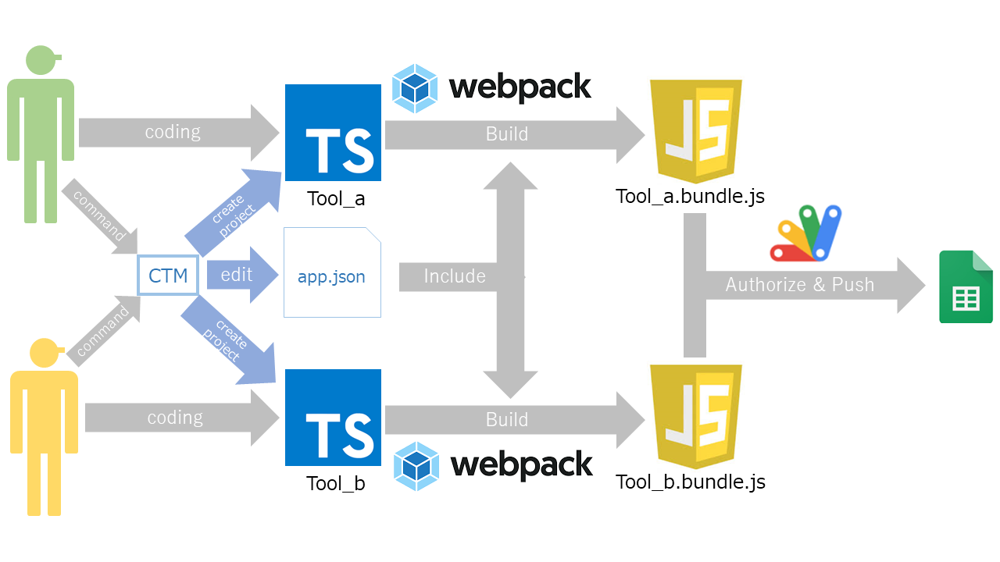

# CTM (Clasp Tool Manager)
## About CTM
CTMはclaspで複数のツールを開発する際、各ツールごとを独立して開発・リリースできるようにする補助ツールです。

## Architecture
<center>
  
</center>

上記の図のように、webpackでbuildする際に`resources/app.json`を注入し、各ツールのエントリポイントとビルド先を対応付けしています。

上図の場合の`app.json`
```json
{"Tool_a":"./src/tool_a/index.ts","Tool_b":"./src/tool_b/index.ts"}
```
`app.json`は`"ツール名":"エントリポイント"`の形で保存されます。ビルド先は`build/{ツール名}.bundle.js`となります。

## Command
コマンドは`npm run`に登録されています。

### `npm run create`
ツールを追加します。<br />
ツール名(ユニーク)、typescriptを使用するか、ツールのエントリーポイントのファイル名を指定すると、`<root>/src`配下にプロジェクトディレクトリが作成されます。<br />
このプロジェクトディレクトリにはエントリーポイントが含まれています。

このとき、`app.json`にも自動的に追加されるため、ユーザはwebpackの構成を意識せず、ツールを追加することができます。

### `npm run delete`
ツールを削除します。<br />
ツール名を指定すると、`<root>/src`配下にある同名のプロジェクトディレクトリを削除します。<br />

このとき、`app.json`内からも自動的に削除されます。

削除されたツールは`<root>/archive`内にzip圧縮された状態で保存されます。<br />
※同名のツールを削除した場合、`<root>/archive`内の**zipファイルは上書きされます**ので、注意してください。
